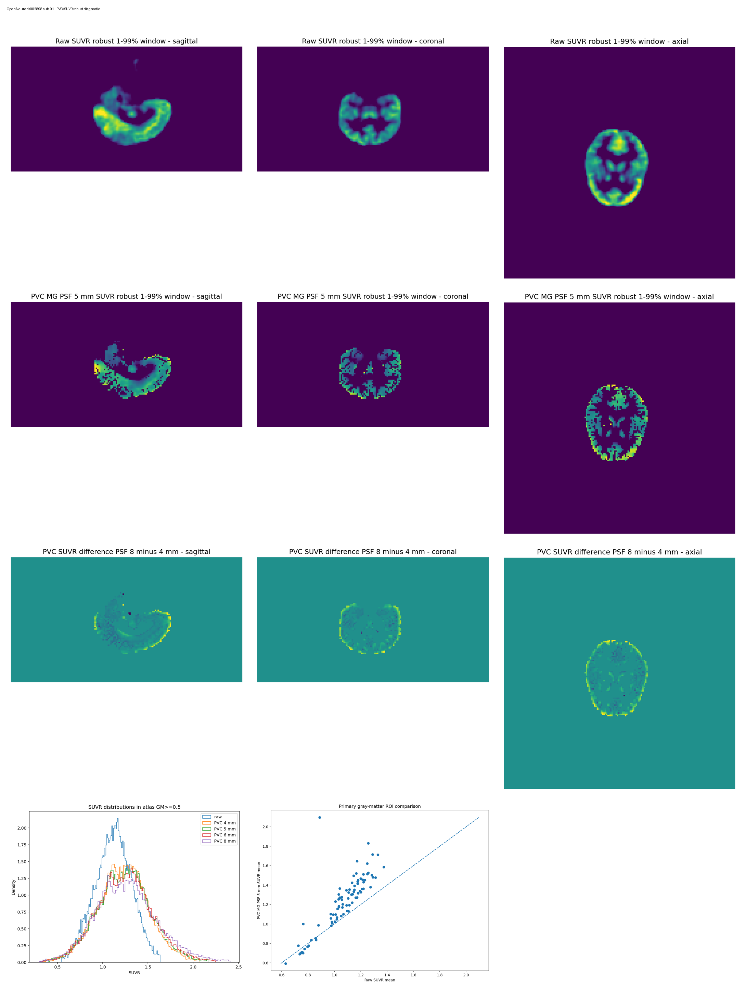
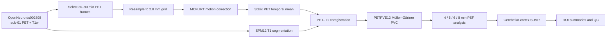

# FDG PET SUVR and PETPVE12 partial-volume correction on OpenNeuro ds002898

[](#validated-results)
[](https://openneuro.org/datasets/ds002898)
[](#citation)
[](LICENSE)
[](https://orcid.org/0000-0001-5627-579X)

A completed and quality-controlled single-subject neuroimaging portfolio
workflow using public dynamic FDG PET and T1-weighted MRI from
[OpenNeuro `ds002898`](https://openneuro.org/datasets/ds002898).

The pipeline covers dynamic-frame selection, PET motion correction, static PET
construction, SPM12 tissue segmentation and PET–T1 coregistration, PETPVE12
Müller–Gärtner partial-volume correction, cerebellar-cortex SUVR, regional
Desikan–Killiany summaries, and 4/5/6/8 mm PSF sensitivity analysis.

> **Research portfolio only.** This repository is not clinical or diagnostic
> software and does not support individual medical interpretation.



## Quick navigation

| Resource | Description |
|---|---|
| [Methods](docs/METHODS_SUB01.md) | Detailed processing and quality-control methods |
| [Results](docs/RESULTS_SUB01.md) | Validated subject-level results and interpretation |
| [Tables](results/tables) | ROI, reference-region and PSF-sensitivity TSV outputs |
| [Summaries](results/summaries) | Machine-readable JSON summaries |
| [Figures](results/figures) | Motion, registration, atlas and SUVR quality-control figures |
| [Scripts](scripts) | Bash, Python and MATLAB workflow code |
| [Citation metadata](CITATION.cff) | Citation information for this software release |

## Scientific scope

This project demonstrates a transparent end-to-end FDG PET processing workflow
on one healthy young adult from a publicly accessible multimodal dataset. The
goal is reproducible method implementation and quality control, not group-level
inference or disease classification.

## Dataset

| Item | Value |
|---|---|
| OpenNeuro accession | `ds002898` |
| Dataset DOI | `10.18112/openneuro.ds002898.v1.0.0` |
| Subject | `sub-01` |
| Tracer | 18F-FDG |
| Source PET | 356 dynamic frames |
| Selected interval | frame starts `>= 1800` and `< 5400` seconds |
| Selected data | 225 frames, starting at 1808–5392 seconds |
| Frame duration | 16 seconds |
| Structural image | T1-weighted MRI |
| Processing grid | 2.8 mm isotropic, `172 × 172 × 93` |

Raw OpenNeuro imaging data and intermediate NIfTI derivatives are not stored in
this repository.

## Workflow



### Main processing stages

1. Select PET frames using BIDS `FrameTimesStart`.
2. Resample the selected 4D PET to a memory-manageable 2.8 mm grid.
3. Perform framewise motion correction with FSL MCFLIRT.
4. Calculate the static PET temporal mean.
5. Segment the T1w image with SPM12.
6. Coregister T1 and tissue probability maps to PET space.
7. Run PETPVE12 Müller–Gärtner three-compartment PVC.
8. Transfer the PETPVE12 Desikan–Killiany atlas to PET space.
9. Calculate raw and PVC SUVR using bilateral cerebellar cortex.
10. Compare PVC estimates across 4, 5, 6 and 8 mm PSF assumptions.

## Validated results

Final validation passed for motion correction, static PET construction,
PET–T1 coregistration, tissue segmentation, atlas placement, PETPVE12 PVC,
SUVR normalization, regional summaries and PSF sensitivity.

| Validation metric | Result |
|---|---:|
| Selected PET frames | 225 |
| Primary gray-matter ROIs | 84 |
| Median PSF coefficient of variation | 1.488% |
| Maximum PSF coefficient of variation | 7.116% |
| Region with maximum PSF sensitivity | `ctx-lh-frontalpole` |
| Primary ROIs above 10% PSF CV | 0 |
| Primary ROIs with negative nominal 5 mm PVC mean | 0 |
| Negative nominal PVC SUVR voxels within the analysis mask | 0.1624% |

The sparse negative PVC voxels did not produce a negative nominal mean in any
primary gray-matter ROI. Full results and qualification of these findings are
provided in [the results report](docs/RESULTS_SUB01.md).

## Repository structure

```text
.
├── CITATION.cff
├── DATA_SOURCES.md
├── LICENSE
├── README.md
├── requirements.txt
├── docs/
│   ├── METHODS_SUB01.md
│   └── RESULTS_SUB01.md
├── results/
│   ├── figures/
│   ├── summaries/
│   └── tables/
└── scripts/
```

## Software

The completed workflow used:

- FSL, including MCFLIRT;
- MATLAB;
- SPM12;
- PETPVE12;
- Python 3 with the packages listed in `requirements.txt`.

The scripts retain paths from the completed portfolio run. Reproduction on
another workstation requires adapting those paths and installing the listed
software.

## Methodological limitations

- The analysis contains one healthy young adult and is not a group study.
- The acquisition used constant-infusion FDG PET.
- The nominal 5 mm PSF follows the published reconstruction post-filter and is
  not treated as a directly measured effective scanner PSF.
- The 4/5/6/8 mm outputs are therefore reported as a sensitivity analysis.
- Cerebellar-cortex SUVR is a transparent portfolio metric for this acquisition,
  not a validated clinical biomarker.
- Major processing stages received visual QC, but no manual anatomical
  parcellation was performed.

## Data and privacy policy

The repository contains scripts, compact derived tables, JSON summaries,
documentation and non-identifying quality-control figures. It excludes raw
imaging data, intermediate NIfTI derivatives, MATLAB intermediates and other
large local files.

## Citation

Citation metadata is available in [`CITATION.cff`](CITATION.cff).

A verified Zenodo DOI will be added only after the GitHub `v1.0.0` release has
been archived successfully. No DOI is inferred or inserted before Zenodo
confirms the record.

## Dataset reference

Jamadar SD, Ward PGD, Close TG, et al. Simultaneous BOLD-fMRI and
constant-infusion FDG-PET data of the resting human brain. *Scientific Data*.
2020;7:363.

OpenNeuro dataset: `10.18112/openneuro.ds002898.v1.0.0`.
